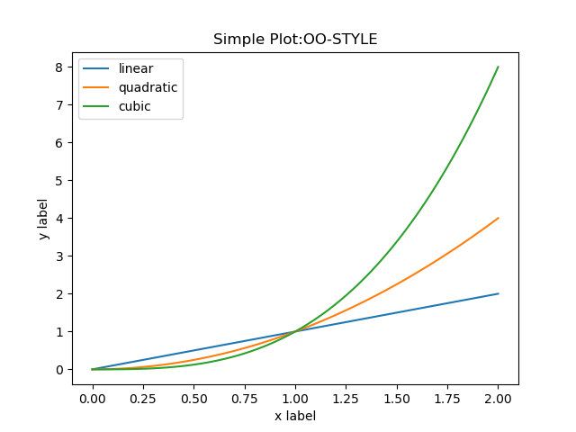
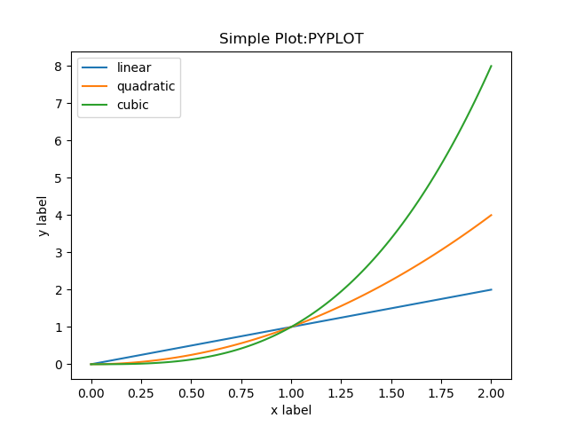
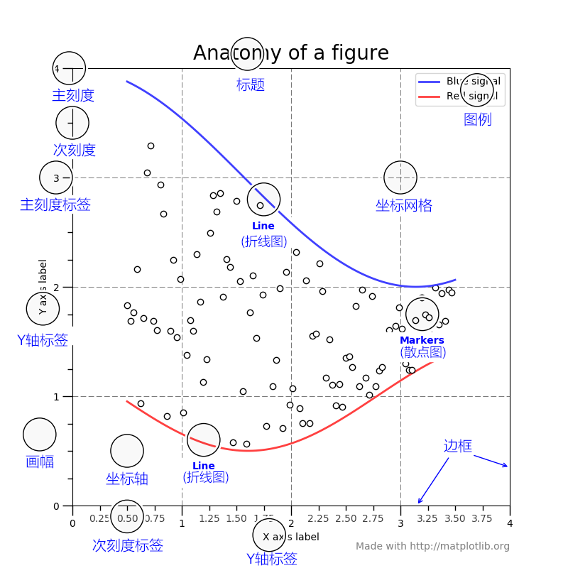

# Matplotlib初相识

Matplotlib是一款应用十分广泛的python绘图工具包，其支持具有两种代码编辑方式，一是面向对象的方式，二是类似Matlab的使用pyplot的函数绘制。前者需要编程者自己创建顶级(figure)及次级容器(axes)，使用该方式可以更好的理解Matplotlib图像的组成元素；后者则通过工具包内置机制自动管理容器，在一些简单的脚本程序中使用比较方便。

---

Matplotlib是python数据处理中常用的可视化工具。可用于Python脚本、Python和IPython Shell、Jupyter notebook，Web应用程序服务器和各种图形用户界面工具包中。

matplotlib有两种基本绘图方式，**面向对象**与**pyplot**，前者采用面向对象的编程方式，显示的创建的figures和axes，并调用其方法画图；后者类似Matlab，使用pyplot的函数绘制图像。

下面的两种方法绘制图像的示例[^1]：

**面向对象方法：**

```python
import numpy as np
import matplotlib.pyplot as plt
x = np.linspace(0, 2, 100)

# Note that even in the OO-style, we use `.pyplot.figure` to create the figure.
fig, ax = plt.subplots()  # Create a figure and an axes.
ax.plot(x, x, label='linear')  # Plot some data on the axes.
ax.plot(x, x**2, label='quadratic')  # Plot more data on the axes...
ax.plot(x, x**3, label='cubic')  # ... and some more.
ax.set_xlabel('x label')  # Add an x-label to the axes.
ax.set_ylabel('y label')  # Add a y-label to the axes.
ax.set_title("Simple Plot:OO-STYLE")  # Add a title to the axes.
ax.legend()  # Add a legend.
fig.savefig("./pic/m1.png")
```


**pyplot方法：**
```python
import numpy as np
import matplotlib.pyplot as plt
x = np.linspace(0, 2, 100)

plt.plot(x, x, label='linear')  # Plot some data on the (implicit) axes.
plt.plot(x, x**2, label='quadratic')  # etc.
plt.plot(x, x**3, label='cubic')
plt.xlabel('x label')
plt.ylabel('y label')
plt.title("Simple Plot:PYPLOT")
plt.legend()
plt.savefig("./pic/m2.png")
```



在面向对象方法中，我们先创建了一个figure和axes对象，二者是绘图的基础，之后在axes中添加了折线、散点、图例等元素。下图展示了Matplotlib绘制图像的基本元素，其中Figure->Axes->Axis->Tick四个层级，下级元素包含在上级元素之中。其中figure和axes可以理解为画板和画板上的一张纸，画板上可以放多张画纸，而图像则主要在画纸上绘制。


[^1]: [Usage Guide](https://matplotlib.org/stable/tutorials/introductory/usage.html#the-object-oriented-interface-and-the-pyplot-interface)