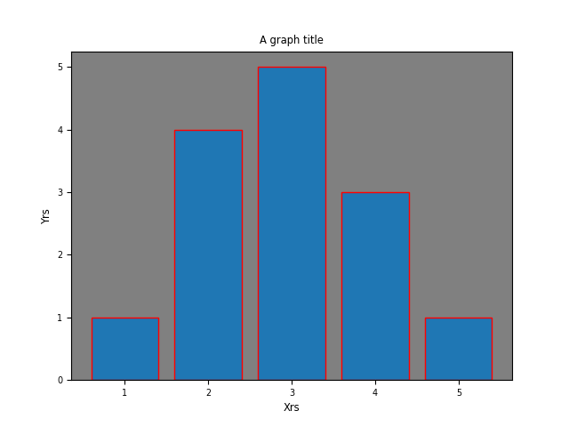

# 艺术画笔见乾坤

如前所述，Figure是画纸，而Axes则是在之上选定的一块绘图区域。在Matplotlib中，一幅图像由各种Artist(matplotlib.artist.Artist)组成，而这些Artist也可以分为两类：
    容器(containers)，用于放置绘图元素的类，如Figure、Axes、Axis、Tick；
    基本要素(primitives)，表示类形状、文字的类，如曲线Line2D，文字text，图斑patches，图像image等。

四个容器类中，Figure是顶级容器，包含Axes；Axes是绘图时的主要交互对象，其中包含Axis，大多数基本要素也都是要在其中绘制；而Axis中又包含Tick，它们之间的关系:$Tick \in Axis \in Axes \in Figure$。而各个容器(containers)中又可包含其他基本要素(primitives)。

使用Matplotlib绘制图像与作画的基本流程相似，首先初始化一个figure对象，在figure中添加Axes，然后在Axes中添加各类基本元素。通常使用plot()、bar()、scatter()、hist()等方法可以快速的在Axes中添加各类元素。

上面提到的Artist是matplotlib一个API，此外还有FigureCanvas和Renderer，它们是matplotlib的三层API：
 - `matplotlib.backend_bases.FigureCanvas`：是绘图区，指明这幅图所要画在什么地方；
 - `matplotlib.backend_bases.Renderer`：是渲染器，指明要如何绘制这幅图；
 - ` matplotlib.artist.Artist`：是绘画元素，它将根据渲染器画在绘图区上。

## matplotlib绘图流程

1. 创建figure及canvas
```python
from matplotlib.backends.backend_agg import FigureCanvasAgg as FigureCanvas
from matplotlib.figure import Figure

fig = Figure()
# 可以使用figsize关键字设置figure的大小
# fig = Figure(figsize=(2.04,1.92))
canvas = FigureCanvas(fig) # canvas需要与figure关联
```

2. 添加Axes
```python
ax = fig.add_subplot(111) # 添加一个axes到fig 

# 添加一个axes到fig并指定axes的位置及长宽，使用set_position()方法可以修改已有axes的位置大小
ax = fig.add_axes([0.2,0.2,0.5,0.7]) 
```

3. 添加基本元素对axes
```python
# 使用axes的方法绘制图形
p1 = ax.bar([1,2,3,4,5],[1,4,5,3,1])
```

4. 添加其他修饰
```python
# 用超小字体设置X轴标签
ax.set_xlabel('Xrs', size='small')
ax.set_ylabel('Yrs', size='small')
# 设置图形标题
ax.set_title('A graph title', size='small')
# 设置axes灰色背景
ax.set_facecolor('grey')
# 设置刻度标签字体
labels = ax.get_xticklabels() + ax.get_yticklabels()
for label in labels:
    label.set_size('x-small')
#设置条形图的边线颜色
for r in p1:
    r.set_edgecolor('red')
# 保存图片
fig.savefig("test.png")
canvas.print_figure("test.png")
```
输出图像：


上面演示中，出现了Figure、Axes等容器类型的Artist。
### Figure

创建Figure的常用方式有三种：matplotlib.figure.Figure()、matplotlib.pyplot.figure()、matplotlib.pyplot.subplots()：
```python
# 1. matplotlib.figure.Figure()
fig = matplotlib.figure.Figure()

# 2. matplotlib.pyplot.figure()
fig = matplotlib.pyplot.figure()

# 3. matplotlib.pyplot.subplots()
fig, ax = matplotlib.pyplot.subplots()
fig,(ax1, ax2) = plt.subplots(1, 2)
```

前两种方法只创建一个Figure、第三种方法创建一个Figure同时创建指定`行*列`个Axes。后两种方法中通过pyplot子模块中的函数创建Figure、它会自动管理用户图像显示的canvas、backend等，可以方便的再桌面显示出图像；而第一中方法，则需要手动管理canvas、backend，并且需要给定图像显示的图像界面，该方法适宜在其他图形界面程序的开发中使用。

Figure是Axes、Line2D、Text等Artist的集合、canvas则是控制了这些Artist如何显示。

下面的代码示例中展示了使用Tkinter或Qt界面显示图像的方法：
```python
import sys
import random

# ref: [Embedding in Tk — Matplotlib 3.4.3 documentation](https://matplotlib.org/stable/gallery/user_interfaces/embedding_in_tk_sgskip.html)

from matplotlib.figure import Figure

def showQt(fig:Figure):
    """
    在Qt界面中显示图像
    """
    from PySide2 import QtCore, QtWidgets, QtGui
    from matplotlib.backends.backend_qt5agg import (
        FigureCanvas, NavigationToolbar2QT as NavigationToolbar)

    # 初始化qt应用程序
    if not QtWidgets.QApplication.instance():
        app = QtWidgets.QApplication(sys.argv)
    else:
        app = QtWidgets.QApplication.instance()

    mw = QtWidgets.QMainWindow()  #初始化主窗口
    mw.setWindowTitle("Figure 1") #设置标题
    window = QtWidgets.QWidget()  #初始化窗户组件
    layout = QtWidgets.QVBoxLayout() #初始化窗户布局
    canvas = FigureCanvas(fig) # 生成一个qt绘图区域
    canvas.draw()
    layout.addWidget(canvas)
    layout.setMargin(0)
    window.setLayout(layout)

    mw.addToolBar(NavigationToolbar(canvas,window)) # 增加工具栏
    # mw.addToolBar(QtCore.Qt.BottomToolBarArea,NavigationToolbar(canvas,window)) # 在底部增加工具栏
    mw.setCentralWidget(window)
    mw.show()

    app.exec_()

def showTk(fig:Figure):
    """
    在Tk界面中显示图像
    """
    import tkinter
    from matplotlib.backends.backend_tkagg import (
        FigureCanvas, NavigationToolbar2Tk as NavigationToolbar)

    # 以下代码是使图片能够即时显示在桌面，如果使有plt.figure()实例化figure类，可以自动
    root = tkinter.Tk()
    root.wm_title("Figure 1")

    # 以下代码是使图片能够即时显示在桌面，如果使有plt.figure()实例化figure类，可以自动

    canvas = FigureCanvas(fig, master=root)  # A tk.DrawingArea.
    canvas.draw()

    # pack_toolbar=False will make it easier to use a layout manager later on.
    toolbar = NavigationToolbar(canvas, root, pack_toolbar=False)
    toolbar.update()

    toolbar.pack(side=tkinter.BOTTOM, fill=tkinter.X)
    canvas.get_tk_widget().pack(side=tkinter.TOP, fill=tkinter.BOTH, expand=1)

    root.mainloop() # 与plt.show()作用类似，启动GUI loop使画的图想显示

fig = Figure()
ax = fig.add_subplot(111) # 添加一个axes到fig
p1 = ax.bar([1,2,3,4,5],[1,4,5,3,1])

ax.set_xlabel('Xrs', size='small')
ax.set_ylabel('Yrs', size='small')
# 设置图形标题
ax.set_title('A graph title', size='small')

# set the edgecolor and facecolor of the axes rectangle to be the same
ax.set_facecolor('grey')

labels = ax.get_xticklabels() + ax.get_yticklabels()
for label in labels:
    label.set_size('x-small')

for r in p1:
    r.set_edgecolor('red')

fig.savefig("savedpic.png") #直接保存图像

showTk(fig) # 使用Tk后端显示图像
showQt(fig) # 使用Qt后端显示图像
```
目前的matplotlib对支持Qt4、Qt5(Pyqt4、Pyqt5、PySide2，PySide6预计在3.5版本中开始支持)。

在，使用PySide2/6如出现下面错误：
```
qt.qpa.plugin: Could not find the Qt platform plugin "windows" in ""
This application failed to start because no Qt platform plugin could be initialized. Reinstalling the application may fix this problem.
```
可增加以下代码，指定`QT_QPA_PLATFORM_PLUGIN_PATH`变量的值来解决：
```
dirname = os.path.dirname(PySide6.__file__)
pluging_path = os.path.join(dirname,'plugins','platforms')
os.environ['QT_QPA_PLATFORM_PLUGIN_PATH']=pluging_path
```

### Axes

Axes是绘图操作的主要对象，其创建方法有：


pyplot.subplot()
pyplot.axes()
pyplot.subplots()

Figure.add_subplot()
Figure.add_axes()
Figure.subplots()

matplotlib.axes.Axes()

Axes的各类绘图方法、如`plot()`、`scatter()`等参考：[matplotlib.axes — Matplotlib 3.4.3 documentation](https://matplotlib.org/stable/api/axes_api.html?highlight=axes#plotting)


1. [Artist tutorial — Matplotlib 3.4.3 documentation](https://matplotlib.org/stable/tutorials/intermediate/artists.html)
2. [Wayback Machine](http://web.archive.org/web/20100830233506/http://matplotlib.sourceforge.net/leftwich_tut.txt)
3. [Gallery — Matplotlib 3.4.3 documentation](https://matplotlib.org/stable/gallery/#embedding-matplotlib-in-graphical-user-interfaces)
4. [Embedding in Qt — Matplotlib 3.4.3 documentation](https://matplotlib.org/stable/gallery/user_interfaces/embedding_in_qt_sgskip.html#sphx-glr-gallery-user-interfaces-embedding-in-qt-sgskip-py)
5. [Embedding in Tk — Matplotlib 3.4.3 documentation](https://matplotlib.org/stable/gallery/user_interfaces/embedding_in_tk_sgskip.html)
6. [错误 qt.qpa.plugin: Could not find the Qt platform plugin "windows" in "" 的解决方法_I'm George 的博客-CSDN博客](https://blog.csdn.net/weixin_40922744/article/details/111355088)
7. [python - use a matplotlib Figure in PyQt - Stack Overflow](https://stackoverflow.com/questions/22217215/use-a-matplotlib-figure-in-pyqt)
8. [CanvasAgg demo — Matplotlib 3.4.3 documentation](https://matplotlib.org/stable/gallery/user_interfaces/canvasagg.html)
