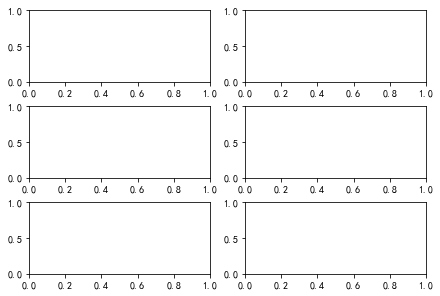
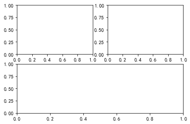
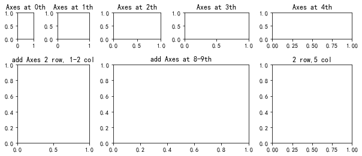
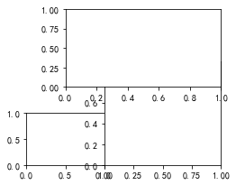

布局、主要有figure的大小；axes的位置、大小、个数等。figure的大小可以使用figsize控制，如plt.subplot()中可以使用figsize参数控制figure的大小，其第一、二个参数分别指定axes的行、列数。matplotlib.figure.Figure.add_subplot()可以在指定行列单元中某个位置添加一个axes，如add_subplot(232)，是在2行3列的网格的第二个网格处添加axes。此外还可控制是否为极坐标、投影方式等。对于非均匀布局的axes，可以借助GridSpec实现。
## 多Axes布局：规则布局、不规则布局
### 规则布局
规则布局有两种，一种是按行、列均匀分割成若干个网格，将Axes放置在一个或多个网格内。
1. 直接行列参数布局
```python
plt.subplots(3,2,constrained_layout=True)
# plt.subplots(3,2,tight_layout=True)

# 或者，与上面效果相同
fig=plt.figure()
fig.set_constrained_layout(True)
# fig.set_tight_layout(True)
fig.subplots(3,2)
```
其中`constrained_layout`和`tight_layout`可以自动优化布局，避免元素重叠。两种方法效果类似，不过`constrained_layout`多数情况下优化效果好一些[^1]。



```python
plt.subplot(221)
plt.subplot(222)
plt.subplot(2,2,(3,4))

# 或者，与上面效果相同
fig=plt.figure()
fig.add_subplot(221)
fig.add_subplot(222)
fig.add_subplot(2,2,(3,4))
```
这里在Figure中分割重2X2的网格，第1、2个网格各放置一个Axes，第3、4个网格放一个Axes；



2. 借助GridSpec布局
该方法使用`GridSpec`类来管理网格，可以对网格大小、间距等做更多样的调整，`GridSpec`可由`matplotlib.gridspec.GridSpec()`和`matplotlib.figure.Figure.add_gridspec()`两种方法生成，二者使用的参数相同。

```python
matplotlib.gridspec.GridSpec(nrows, ncols, figure=None, 
	                         left=None, bottom=None, right=None, top=None, 
	                         wspace=None, hspace=None, 
	                         width_ratios=None, height_ratios=None)
```
参数说明：  
 - nrows, ncols：网格的行、列数；  
 - figure：只在约束布局（constrained layout）中有效，用于产生合适的布局；  
 - left, right, top, bottom：小数形式指定网格的范围；  
 - wspace, hspace：网格间横向和纵向间距；  
 - width_ratios, height_ratios：列、行的相对宽、高度，数组大小分别与列、行数相同。  

```python
fig = plt.figure(figsize=(10, 4))
spec = fig.add_gridspec(nrows=2, ncols=5,width_ratios=[1,2,3,4,5], height_ratios=[1,3],hspace=0.5,wspace=0.5)
for i in range(5):
    ax=fig.add_subplot(spec[i])
    ax.set_title("Axes at {}th".format(i))
ax=fig.add_subplot(spec[1,0:2])
ax.set_title("add Axes 2 row, 1-2 col")
ax=fig.add_subplot(spec[7:9])
ax.set_title("add Axes at 8-9th")
ax=fig.add_subplot(spec[1,4]) # 在第2行第5列添加一个
ax.set_title("2 row,5 col")
```

这里网格可以用先行后列的序号指定来指定，也可用行、列来指定，计数从0开始。

绘图效果：




### 不规则布局
使用`plt.axes()`和`fig.add_axes()`指定Axes的左下角位置和长、宽，可以实现任意不规则的布局。如下面的示例：

```python
plt.axes([0,0,0.2,0.2])
plt.axes([0.2,0,0.3,0.4])
plt.axes([0.1,0.3,0.4,0.3])
```



## Axes外观设置
1. 坐标系
2. 坐标轴：共享、双坐标轴、无坐标轴


## 字体问题
`plt.rcParams['font.sans-serif'] = ['SimHei']`设置字体，绘图显示中文出错：
```
Font family ['sans-serif'] not found. Falling back to DejaVu Sans.
findfont: Generic family 'sans-serif' not found because none of the following families were found: SimHei
```


1. 下载字体SimHei.ttf，将SimHei.ttf移动到字体文件存储目录中；
```bash
# 新建一个自定义字符目录
sudo mkdir /usr/share/fonts/custom
# 移动字体文件到目录
sudo mv SimHei.ttf /usr/share/fonts/custom
# 修改字体文件权限
sudo chmod 644 /usr/share/fonts/custom/SimHei.ttf
```
2. 建立字体缓存
```bash
sudo fc-cache -fv
```

`fc-cache`的搜索目录有`$HOME/.local/share/fonts`, `$HOME/.fonts`, `/usr/share/fonts`等目录，字体文件放在其中任意目录或其子目录中都可以。其中`/usr/share/fonts`需要管理员权限操作。

3. 查看matplotlib的缓冲目录，并删除，重启Python shell；
```python
import matplotlib
print(matplotlib.get_cachedir())
# /home/user/.cache/matplotlib
```
删除缓存文件
```bash
rm -rf /home/user/.cache/matplotlib
```

[Constrained Layout Guide — Matplotlib 3.4.3 documentation](https://matplotlib.org/stable/tutorials/intermediate/constrainedlayout_guide.html?highlight=constrain)

[^1]: [`tight_layout` versus `constrained_layout` · Issue #30 · matplotlib/cheatsheets](https://github.com/matplotlib/cheatsheets/issues/30)